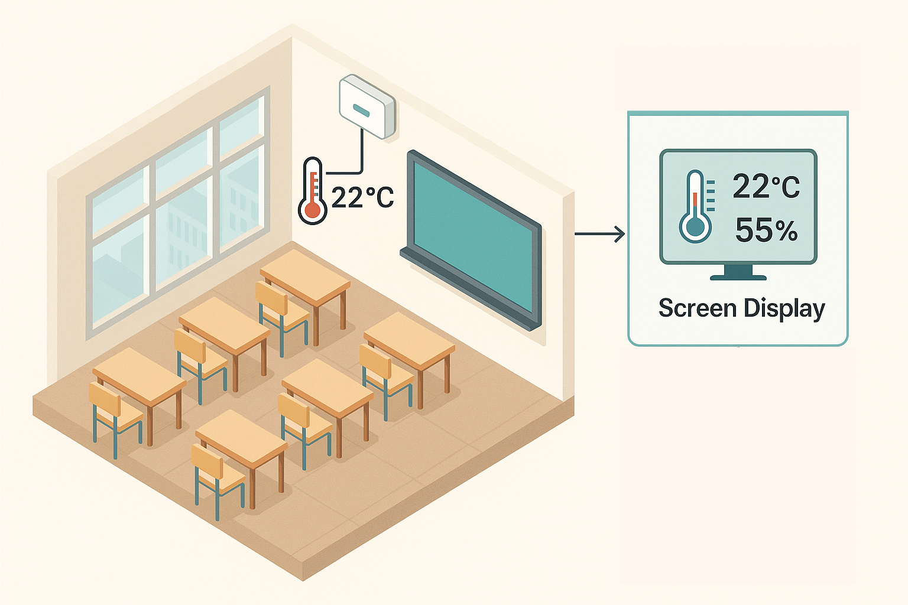

University Sensors 

========

Write an application to manage measurements inside a university.

Classes are located in the `it.polito.temperatureControl` package; the main class is `Control`. The `TestExample` class in the `example` package shows usage examples for the main methods and examples of the requested checks. You are required to implement the requested checks only. Exceptions in the methods described below are of `InvaliddControlException` type.

The [JDK documentation](https://oop.polito.it/api/) is located on a local server.

The Italian version of these requirements is available in [README_it.md](README_it.md).

R1 - Building
---------------

The interaction with the system takes places through class `Control` which can be  instantiated providing the constructor with the name of the university.
The name can be retrieved using the getter `getName()`.

It is possible to define a new building by means of the method `createBuilding()` which accepts the alphanumeric code, name (ex: "Sede Centrale", "Cittadella") and description.
In case of duplicate code the method throws an exception.

The methods `getCode()` and `getName()` of the class Building return the code and the name of the building respectively.

This class also implements `getBuildings()` that returns all the buildings, and it's possible to update and delete buildings with the methods `updateBuilding()` and `deleteBuilding()` of the class `Control`

R2 - Block
----------

Every Block represents a group of rooms, for example the groups defined by different letters (R,I,T,M,N...)
The definition of a new block is carried on by method `createblock()` which accepts the building code, the block code, rooms names in that block and a brief description of the block.

The method `getName()` returns the name of the group of classrooms that defines the block.
Method `getBlocks()` returns all the blocks of the building provided.

It is also possible to update or delete a block by the methods `updateblock()` or `deleteblock()`. In updateblock if a room has the same name as a previusly present one in the same block , it should not be added again.

R3 - SensorRoom
--------------
Each room has exactly one sensor.

The method `addSensorToRoom()`, which accepts : a  sensor Id identifier, the room name, the installation date and a set of capabilites, installs a sensor in an existing classroom.

    •	sensorId is a unique identifier for the sensor device.
	•	roomName identifies the existing room.
	•	installationDate is the date of installation in YYYY-MM-DD format.
    •	capabilities is a set of values from the predefined enumeration SensorCapability,
         indicating whether the sensor supports "TEMPERATURE", "HUMIDITY", or both.

If the room does not exist in the control system, an exception is thrown and if the sensorId has already been used in another room, an exception is thrown.

The method `hasSensor(String roomName)`  returns true if the room has a sensor installed, false otherwise.

The method `getSensorInfo(String roomName)` returns the sensor ID, installation date for the specified room, and the capabiltiies in this format:
"sensorId_installationDate_capabilites" (e.g B356_1999-09-09_TEMPREATURE_HUMIDITY)

The method `getAllSensorRooms()` returns a collection of room names that have sensors installed.

The method `getSensorRoomsInBuilding(String buildingName)` returns the list of all sensor-equipped rooms located in the specified building.

If the building is not known, an exception is thrown.

R4 - Read from file
--------------------
Sensor data must be loaded into the system using two separate files:

1. Sensor Info File

This file contains metadata about the sensors and is used to register them into the system.
Each line in the file must be formatted as follows:

    •   sensorId ; roomName ; installationDate ; capabilities;

The method `readSensorInfos(String sensorInfoFile)` must validate that the room exists and ensure that each sensorId is unique.
An exception is thrown in case of an error.

2. Sensor Readings File:

This file provides actual sensor measurement data.
Each line in the file must be formatted as:

    •   sensorId ; timestamp ; humidity? ; temperature?;

timestamp: must follow the format YYYY-MM-DD HH:MM:SS.
humidity and temperature: optional numeric value (or empty if not provided).

The method `readSensorReadings(String sensorReadingFile)` must validate if a humidity or temperature value is present 
but the sensor does not support it. If both humidity and temperature values are missing, the sensor is considered non-functioning
for that timestamp and should be logged accordingly. 

R5 - Measurements
------------

Method `getBlockStats()` allows retrieving measurements of temperature and humidity in an block, it accepts the name of the block for which you are computing and returns a map example ('humidity': 100 g/m^3 , 'temperature': 30°) .

The method `getTooHumidRooms(R)` returns a list of rooms for which humidity mean exceed 20 g/m^3 in a given block for more then 2 hours    . (the mean is calculate taking all mesuraments present in a day and calculating the mean)

The method `getTooHotRooms(R)` returns a list of rooms for which temperature mean exceed 30 ° in a given block for more then 4 hours  .

The method `getFreezingRooms()` returns a list of all rooms in the university where temperature is at least once today less then passed parameter  : example( 20).

the method `getBrokenSensorsNumber()`  returns the number of sensors whose mesurements doesn't follow his capabilities . (for example a sensor that is type humidity but has empty humidity mesurements )

